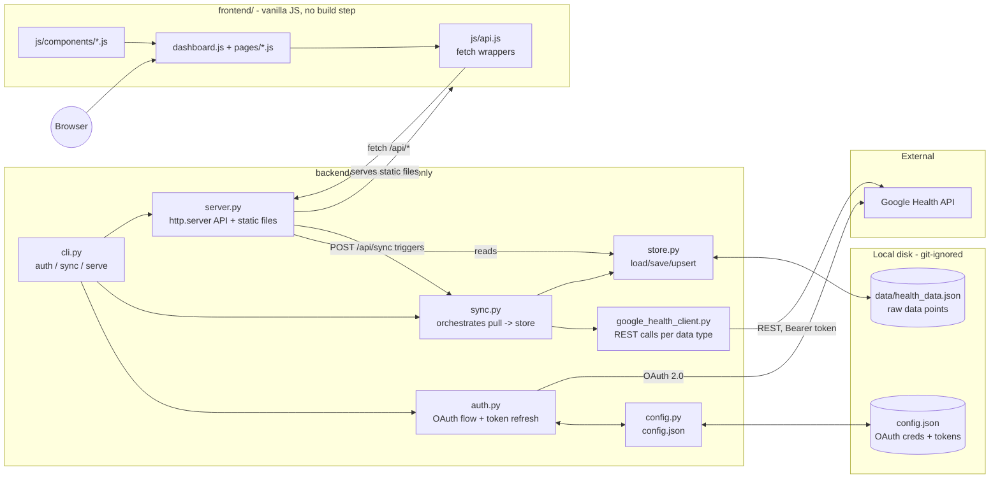

# Architecture Review

Reviewed as of 2026-08-20, against the implemented code in `backend/` and
`frontend/` (not just the planning docs in `docs/`, which occasionally lag
the code, noted below where they diverge). Written with one specific
forward-looking goal in mind: **moving stored health data off the local
JSON file and into a database**. Every section below is read with that
lens, and the last section is a concrete gap list for that migration.

## 1. System overview

A single-user, local-only personal health dashboard: pull data from the
Google Health API, cache it on disk, and view it in a browser. There is no
multi-user concept, no cloud deployment, and no write-back to Google, it
is strictly read-and-display.



## 2. Components

### 2.1 Backend

Constrained to **only** the packages bundled in Esri ArcGIS Pro 3.5's
`arcgispro-py3` conda environment, no `pip install`. That constraint
shapes almost every architectural choice below:

| Module | Responsibility |
|---|---|
| `config.py` | Load/save `config.json` (OAuth client id/secret, access/refresh tokens). Whole-file read/write, no schema validation. |
| `auth.py` | Google OAuth 2.0 authorization-code flow. Spins up a throwaway `http.server` to catch the redirect once, exchanges the code for tokens, refreshes on expiry (60s margin). |
| `http_client.py` | Thin `requests`/`urllib.request` abstraction (falls back to stdlib if `requests` isn't present). |
| `google_health_client.py` | Per-data-type REST calls against `health.googleapis.com/v4`, including the `dailyRollUp` workaround for `steps`. `DATA_TYPES` is the single source of truth for metric → Google data-type-id → filter field → read method. |
| `sync.py` | `sync_all()`: for each metric, resumes from `last_synced` (or backfills 30 days), fetches, and delegates storage to `store.py`. Per-metric try/except so one failing metric doesn't abort the run. |
| `store.py` | The entire persistence layer. `load_store()`/`save_store()` read/write the whole `health_data.json` file; `add_data_points()` upserts by a best-effort point key (`name` → `time` → `civilStartTime` → content hash). |
| `server.py` | stdlib `http.server`/`ThreadingHTTPServer` query API. Reshapes raw stored points into the `api-contract.md` response shapes **at request time**, on every call, no caching. Also serves `frontend/` as static files. |
| `cli.py` | Entry point: `auth` / `sync` / `serve`. |

Key characteristic: **raw API payloads are stored as-is**, grouped by
metric name, rather than normalized into a designed schema. The
"friendly" per-metric shape (`date`, `value`, etc.) is derived in
`server.py` on every read via a set of `_reshape_*` functions, several of
which are explicitly marked `UNVERIFIED` (guessed field paths not yet
checked against live data, `temperature` as of this review).

### 2.2 Storage

A single JSON file, `backend/data/health_data.json`:

```json
{
  "metrics": { "steps": [ {...} ], "heart_rate": [ {...} ], "...": [] },
  "last_synced": { "steps": "2026-08-17", "...": "..." }
}
```

Every read (`load_store()`) parses the whole file; every write
(`save_store()`) serializes and overwrites the whole file. There is no
partial read/write, no indexing, and no locking.

### 2.3 Frontend

Vanilla JS/HTML/CSS, no build step, ES modules loaded directly by the
browser. `js/api.js` wraps `fetch()` calls to the backend's same-origin
API. `dashboard.js` and `pages/*.js` wire up per-page views, `components/`
holds small render functions per widget/card. No client-side state
library, module-scoped state only.

### 2.4 External dependency

Google Health API (OAuth 2.0, REST, per-data-type endpoints). This is the
**only** source of truth for real data; the local store is purely a
cache/mirror of whatever was last pulled.

## 3. Data flow

**Sync (write path):** `cli.py sync` or `POST /api/sync` → `sync.sync_all()`
→ `auth.get_valid_access_token()` (refreshes if needed) →
`google_health_client.list_data_points()` per metric → `store.add_data_points()`
upserts into the in-memory dict → `store.save_store()` rewrites the whole
file → `last_synced[metric]` advanced only for metrics that succeeded.

**Query (read path):** browser → `GET /api/metrics` or
`/api/metrics/{metric}` → `server.py` loads the **entire** JSON file →
reshapes the relevant metric's raw points into the contract shape →
filters by date range → returns JSON. This happens fresh on every request;
nothing is cached or pre-aggregated.

## 4. Architectural strengths worth preserving

- **`store.py` is already a seam.** `sync.py` and `server.py` never touch
  `health_data.json` directly, they only call `store.load_store()`,
  `store.save_store()`, `store.add_data_points()`. Swapping the storage
  backend means rewriting this one module's internals, not every caller.
- **Raw-payload storage was a deliberate, reasonable choice** given how
  much of the Google Health API's actual field shapes had to be
  reverse-engineered live (see `docs/backend-architecture.md`'s per-metric
  confidence notes). It avoided silently losing data to a wrong guess.
- **Per-metric isolation in `sync_all()`** (try/except per metric,
  `last_synced` only advanced on success) is a sound pattern to keep
  regardless of storage backend.
- **The upsert key strategy** (`_point_key`) already identifies a natural
  primary/unique key per metric's points, directly reusable as a DB
  unique constraint.

## 5. Gaps

### 5.1 General (independent of the database goal)

- **No automated tests.** Nothing under `backend/` or `frontend/`
  exercises `store.py`'s upsert/dedup logic, the `_reshape_*` guesses in
  `server.py`, or the sync error-isolation path. Given how many reshaping
  functions are explicitly `UNVERIFIED`/guessed, regression risk on any
  refactor (including a DB migration) is high without them.
- **No request-level auth on the query API.** Acceptable per
  `docs/privacy-and-data-handling.md` *only* because it's localhost-only.
  It becomes a real gap the moment this runs anywhere network-reachable
  (including a home LAN), which a DB-backed, possibly-hosted version might.
- **No rate-limit/backoff handling** against the Google Health API, an
  open question in `docs/backend-architecture.md` that's still open.
- **No logging/observability.** `server.py`'s `log_message` is silenced by
  default; failures during reshaping are swallowed (`except Exception:
  return []`) with no record of what broke or when.
- **Secrets stored in plaintext** (`config.json`: client secret, access
  token, refresh token). Reasonable for a single local user today, but
  worth flagging before any deployment beyond one machine.
- **`temperature` reshaping is still unverified**, a correctness gap that
  will get carried into any DB migration unless addressed first (garbage
  in, garbage schema).
- **`server.py` recomputes reshaping on every request** with no caching,
  fine at today's (single-user, days-of-data) scale, but a sign the read
  path has no real query layer, just "load everything, filter in Python."

### 5.2 Specific to "push data to a database"

This is the current constraint that most directly conflicts with that
goal: **`docs/backend-architecture.md` and `README.md` both state storage
is deliberately "a local JSON file... instead of a database (SQLite
included)."** That decision needs to be explicitly revisited/superseded
before implementation starts, not just bypassed in code, otherwise the
docs and the system disagree about what the architecture *is*.

Concrete gaps to close for a database-backed store:

1. **No schema.** Points are opaque dicts with per-metric, sometimes
   inconsistent internal shapes (nested under `heartRate`, `sleep`,
   `exercise`, etc., with fallback field-name guesses in several
   reshapers). A database needs either (a) a normalized column-per-field
   schema per metric table, or (b) a hybrid: fixed columns for the fields
   every query filters/sorts on (`metric`, `point_key`, `date`,
   `synced_at`), plus a JSON column for the rest of the raw payload. Given
   how much of the payload shape is still being discovered
   metric-by-metric, **(b) is the lower-risk path**, it preserves the
   current "store raw, reshape on read" strategy instead of forcing a
   premature normalized schema for fields that aren't fully verified yet
   (`temperature` today, possibly others as new metrics are added).
2. **No transactional read-modify-write.** `store.add_data_points()`
   currently loads the *entire* metric list into memory, merges by key,
   and writes it all back, a pattern that maps to an unsafe
   read-then-overwrite in a DB unless replaced with real per-row
   `UPSERT`/`INSERT ... ON CONFLICT` statements keyed by `_point_key`'s
   logic (which should become a DB `UNIQUE` constraint, not an
   application-level dict merge).
3. **No concurrency control.** `server.py` runs on `ThreadingHTTPServer`,
   so concurrent requests are already possible (e.g. a `POST /api/sync`
   overlapping a `GET /api/metrics`). Against a JSON file this is a
   latent race (no file locking); against a DB it needs to be handled
   deliberately (transactions, or at minimum a single writer/many readers
   discipline) rather than inherited by accident.
4. **No migration/versioning tooling.** There's no mechanism today to
   evolve a schema over time (new metric, new field). Any DB adoption
   should bring a lightweight migration approach (even a hand-rolled
   `schema_version` table with numbered SQL scripts), there's currently
   nothing to build on.
5. **Engine choice is constrained by the ArcGIS Pro package rule.**
   `sqlite3` is Python stdlib, ships with every CPython install including
   `arcgispro-py3`, and requires no `pip install`, it is very likely the
   database engine that fits the existing constraint with the least
   friction, and is a small step from "JSON file" both operationally
   (still a single local file) and conceptually (still no server
   process). A networked DB engine (Postgres/MySQL/SQL Server) would need
   its driver confirmed against `arcgispro-py3`'s bundled packages first
   (per the still-unconfirmed `conda list` from `docs/backend-architecture.md`
   §"Verifying available packages"), Esri's own stack does bundle some
   enterprise-geodatabase DB drivers, but that hasn't been checked here,
   and a networked DB also reopens the "local-only, no server exposed"
   privacy stance in `docs/privacy-and-data-handling.md`.
6. **`last_synced` and data are currently co-located** in one JSON blob;
   a DB design should decide explicitly whether sync bookkeeping is a
   table of its own (recommended, it's structurally different from a
   health data point: one row per metric, not one row per sample) rather
   than carrying over the current single-file coupling.
7. **No data-growth story.** `planning.md` flags "JSON file growth" as an
   open question never resolved. A DB migration is the natural point to
   also decide retention/partitioning (e.g. index on `(metric, date)`)
   instead of deferring it again.
8. **Query layer would need to move from "load all, filter in Python"
   to real queries.** `_metric_records()`/`_parse_range()` in `server.py`
   filter by date range in Python after loading everything. A DB-backed
   version should push that filtering into `WHERE date BETWEEN ? AND ?`
   so the API layer stops scaling linearly with total stored history.
9. **`docs/privacy-and-data-handling.md`'s file list is storage-specific**
   (`backend/config.json`, `backend/data/health_data.json` called out by
   name for `.gitignore` and "what must never be committed"). A new
   database file (e.g. `backend/data/health_data.db` or similar) needs
   the same treatment added explicitly, in the same commit that
   introduces it, not assumed to be covered by the existing entries.

## 6. Suggested next step

Given the above, the lowest-risk path to the stated goal is: adopt
`sqlite3` (stdlib, fits the ArcGIS Pro constraint) behind the existing
`store.py` interface (`load_store`/`save_store`/`add_data_points`, or
their functional replacements), using a hybrid schema, fixed columns for
`metric`, a computed unique `point_key`, `date`, `synced_at`, plus a JSON
column for the raw payload, so `server.py`'s reshaping logic barely
changes. That keeps the raw-payload strategy that's already proven useful
for this project's still-evolving field-shape discoveries, while gaining
real transactions, a unique constraint instead of an in-memory dict merge,
and indexed date-range queries. Normalizing further (real columns per
verified field) can follow per-metric, once each metric's shape is fully
confirmed, the same incremental confidence path `backend-architecture.md`
already used for JSON field discovery.
